# DSO101 Assigment 1

**Github repo link** : https://github.com/SangayZin/sangaytenzin_02230298

**Course:** DSO101 – Continuous Integration and Continuous Deployment

**Student:** Sangay Tenzin

**Student No:** 02230298

**Assignment:** Todo Application with Docker and Render Deployment

---

# 1. Introduction

This assignment focuses on building and deploying a **full-stack Todo application** using modern DevOps practices. The goal of the project is to understand how **Continuous Integration (CI)** and **Continuous Deployment (CD)** work in real software systems.

The application allows users to **add, edit, complete, and delete tasks**. The system consists of three main parts:

* **Frontend:** User interface for managing tasks
* **Backend:** API server that processes requests
* **Database:** Stores tasks permanently

The project also demonstrates how to **containerize applications using Docker** and deploy them on **Render.com** with automatic deployment from **GitHub**.

---

# 2. Technology Stack

The following technologies were used to build the application.

### Frontend

* React.js
* CSS for styling
* Environment variables for API configuration

The frontend provides a user interface where users can manage their tasks.

### Backend

* Node.js
* Express.js
* SQLite database
* dotenv for environment variables

The backend provides a **REST API** that allows the frontend to perform CRUD operations.

### DevOps Tools

* Docker (for containerization)
* GitHub (version control)
* Render.com (deployment platform)

---

# 3. Project Structure

The project follows a structured folder organization.

```
todo-app
│
├── backend
│   ├── server.js
│   ├── package.json
│   ├── Dockerfile
│
├── frontend
│   ├── src
│   ├── package.json
│   ├── Dockerfile
│
├── render.yaml
├── .gitignore
└── README.md
```

This structure separates the **frontend and backend services**, making the project easier to manage.

---

# 4. Local Development Setup

Before deployment, the application was tested locally.

### Backend Setup

First, dependencies were installed and the backend server was started.

```bash
cd backend
npm install
npm start
```

The backend server runs on:

```
http://localhost:5000
```

To confirm that the backend is running, the following command was used:

```bash
curl http://localhost:5000/api/health
```

The server returned a message confirming that it is working.

---

### Frontend Setup

The frontend application was started in another terminal.

```bash
cd frontend
npm install
npm start
```

The frontend runs on:

```
http://localhost:3000
```

Users can open the website in the browser and manage their tasks.

---

# 5. Environment Variables

Environment variables were used to store configuration settings.

This helps keep sensitive information separate from the code.

### Backend Environment Variables

```
PORT=5000
DB_TYPE=sqlite
```

### Frontend Environment Variables

```
REACT_APP_API_URL=http://localhost:5000
```

The `.env` files were added to **.gitignore** so that they are not uploaded to GitHub.

---

# 6. Application Features

The Todo application supports the following features:

### Add Task

Users can create a new task by entering a title and description.

### Edit Task

Users can update an existing task.

### Complete Task

Users can mark a task as completed.

### Delete Task

Users can remove tasks from the list.

All tasks are stored in the **SQLite database**, so they remain saved even after refreshing the page.

---

# 7. Docker Containerization (Part A)

Docker was used to package the application into containers. This ensures that the application runs the same way on any system.

### Backend Docker Image

A Docker image for the backend was built using the command:

```bash
docker build -t sangay298/be-todo:02190108 .
```


### Frontend Docker Image

Similarly, the frontend image was built using:

```bash
docker build -t sangay298/fe-todo:02190108 .
```


The student ID was used as the **Docker image tag**.

---

### Testing Docker Containers

After building the images, the containers were tested locally.

Backend container:

```bash
docker run -p 5000:5000 sangay298/be-todo:02190108
```

Frontend container:

```bash
docker run -p 3000:3000 sangay298/fe-todo:02190108
```

The application was accessed through the browser to verify that it worked correctly.

---

# 8. Pushing Images to Docker Hub

After testing, the Docker images were uploaded to **Docker Hub**.

First, login was done using:

```bash
docker login
```

Then the images were pushed:

```bash
docker push sangay298/be-todo:02190108
docker push sangay298/fe-todo:02190108
```
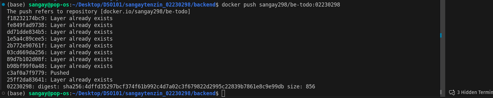

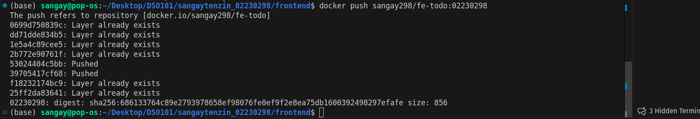


Images can be downloaded and deployed from Docker Hub.

---

# 9. Deployment on Render.com

The application was deployed using **Render.com**.

### Backend Deployment

A new **Web Service** was created using the backend Docker image.

Environment variable used:

```
PORT=5000
```

After deployment, Render provided a **backend URL**.

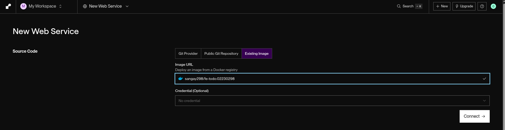
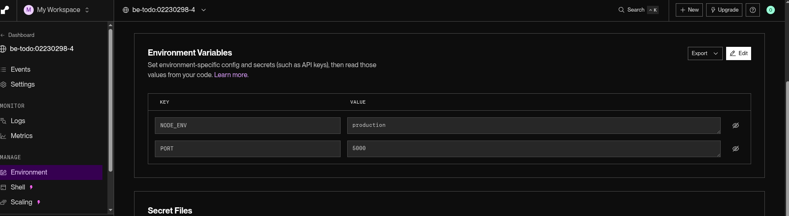
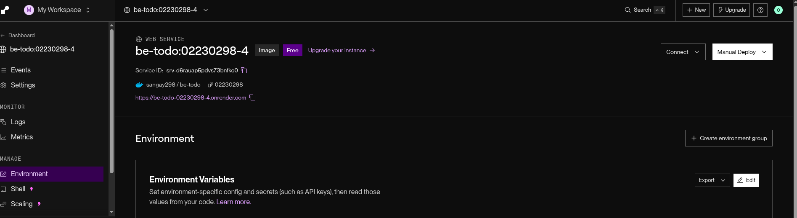
---

### Frontend Deployment

Another Web Service was created using the frontend Docker image.

Environment variable used:

```
REACT_APP_API_URL=https://be-todo-02230298-4.onrender.com
```

This connects the frontend to the deployed backend service.
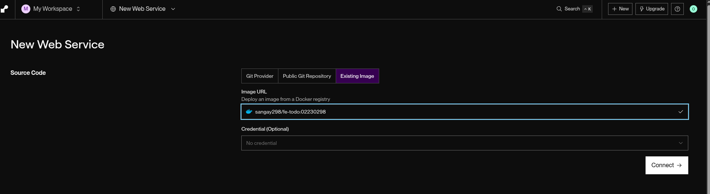
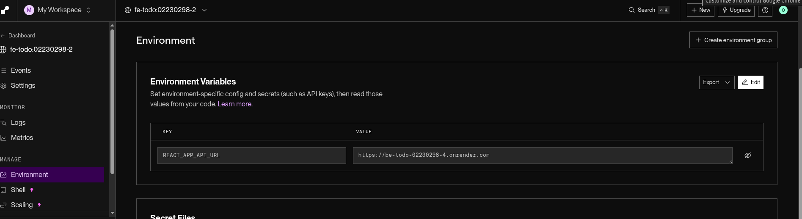
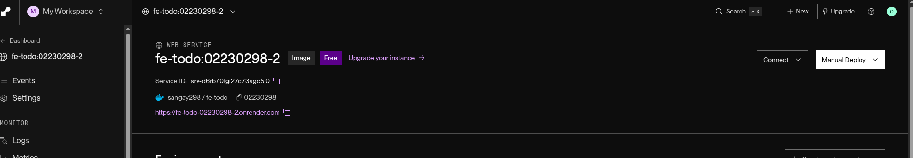

---
## Docker
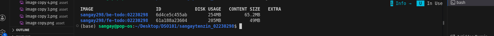
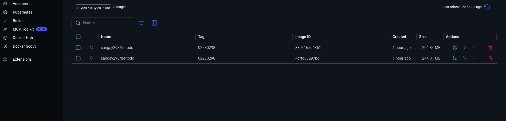


---

# Part B – Automated Deployment using Render Blueprint

## Overview

To streamline the deployment process, I implemented a **Render Blueprint** using a `render.yaml` configuration file.

This setup enables Render to:

- Pull the GitHub repository automatically
- Build Docker images for each service
- Deploy services on every new commit push

---

## Repository Structure

```
todo-app
│
├── frontend
│   ├── Dockerfile
│   └── .env.production
│
├── backend
│   ├── Dockerfile
│   └── .env.production
│
└── render.yaml
```

---

## render.yaml Configuration

The blueprint defines two web services — one for the backend and one for the frontend:

```yaml
services:
  - type: web
    name: be-todo
    runtime: docker
    plan: free
    dockerfilePath: ./backend/Dockerfile
    envVars:
      - key: PORT
        value: 5000
    autoDeploy: true

  - type: web
    name: fe-todo
    runtime: docker
    plan: free
    dockerfilePath: ./frontend/Dockerfile
    envVars:
      - key: REACT_APP_API_URL
        fromService:
          name: be-todo
          type: web
          property: hostport
    autoDeploy: true
```

### What Each Field Means

| Field | Purpose |
|--------|---------|
| `type: web` | Defines the service as a web application |
| `env: docker` | Instructs Render to use Docker for deployment |
| `autoDeploy: true` | Automatically redeploys on new Git commits |
| `dockerfilePath` | Location of the Dockerfile for each service |
| `envVars` | Runtime environment variables |

### Important Notes

- **Backend Service (`be-todo`)**  
  - Runs on port `5000`  
  - Uses SQLite with temporary storage at `/tmp/todos.db`

- **Frontend Service (`fe-todo`)**  
  - Runs on port `3000`  
  - `VITE_API_URL` must point to the backend URL (used during Docker build)

---

## Step-by-Step Deployment Guide

### Step 1: Connect GitHub to Render

1. Log in to your [Render Dashboard](https://dashboard.render.com)
2. Click **"New +"** and select **Blueprint**
3. Choose **"Connect a repository"** and authorize GitHub
4. Select the repository containing code

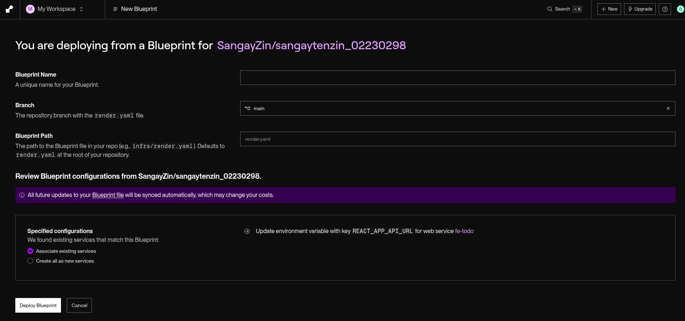

### Step 2: Configure the Blueprint

- Render automatically detects the `render.yaml` file
- Review the detected services and their configurations
- Update environment variables if needed (e.g., API URLs)

### Step 3: Start Deployment

Click **"Deploy"** — Render will:

- Clone the repository
- Build Docker images for each service
- Deploy both frontend and backend services


### Step 4: Verify Deployment

Once finished, Render provides live URalt textLs:

- Backend: `https://be-todo-xtad.onrender.com`
- Frontend: `https://fe-todo-pdhe.onrender.com`

Click the frontend URL to access the live app.

---

## Automatic Deployments on Git Push

With `autoDeploy: true`, every code push triggers a fresh deployment.

### Trigger Example

```bash
git add .
git commit -m "Update application"
git push origin main
```

### What Happens Automatically

1. Render detects the new commit
2. Docker images are rebuilt
3. Services are redeployed
4. The live app is updated — **no manual steps required**

---

## Troubleshooting Common Issues

### Issue 1: Frontend cannot reach backend

**Solution**  
Verify that `VITE_API_URL` in `render.yaml` matches the actual backend URL (e.g., `https://be-todo-xtad.onrender.com`).

### Issue 2: Build fails with npm errors

**Solution**  
- Ensure `package.json` dependencies are up to date  
- Check Node.js version compatibility in Dockerfile  
- Commit `package-lock.json` to the repository

### Issue 3: Environment variables not loading

**Solution**  
- Frontend variables must be set **at build time** in `render.yaml`  
- Backend variables apply at runtime  
- Restart services manually if changed variables after deployment

---

## 8. CI/CD Pipeline Overview

This project implements a complete CI/CD pipeline using **GitHub + Render**.

### Workflow Diagram

```
Developer commits code
         ↓
Git push to GitHub
         ↓
Render webhook triggered
         ↓
Repository cloned
         ↓
Docker images built
         ↓
Services deployed
         ↓
Application updated live
```

### How It Works

| Component | Role |
|-----------|------|
| **GitHub** | Source control & trigger point |
| **Render Webhook** | Listens for new commits |
| **Docker** | Builds reproducible images |
| **render.yaml** | Defines deployment behavior |

### Key Benefits

- **Fully automated** — no manual deployment steps  
- **Fast updates** — changes go live in minutes  
- **Consistent** — same process every time  
- **Immediate feedback** — build failures are visible instantly  
- **Scalable** — easy to add more services

---

## 9. Challenges Encountered

During this project, I faced and resolved several issues:

| Challenge | Resolution |
|-----------|-------------|
| Docker build errors | Debugged Dockerfile syntax and dependency issues |
| Environment variable mismatch between frontend/backend | Verified and corrected `VITE_API_URL` values |
| Deployment failures due to incorrect API URLs | Cross-checked URLs from Render dashboard |
| Frontend not connecting to deployed backend | Ensured build-time variables were correctly passed |

These were fixed by analyzing Docker logs and validating environment configurations.

---

## 10. Conclusion

This assignment provided practical, hands-on experience with modern DevOps tools and deployment workflows.

### Key Skills Gained

- **Containerization** using Docker  
- **Pushing images** to Docker Hub  
- **Deploying services** on Render  
- **Managing environment variables** across services  
- **Automating builds and deployments** with GitHub + Render  


