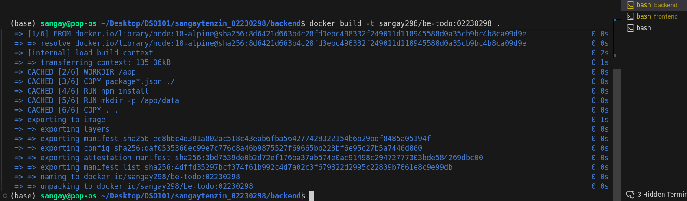
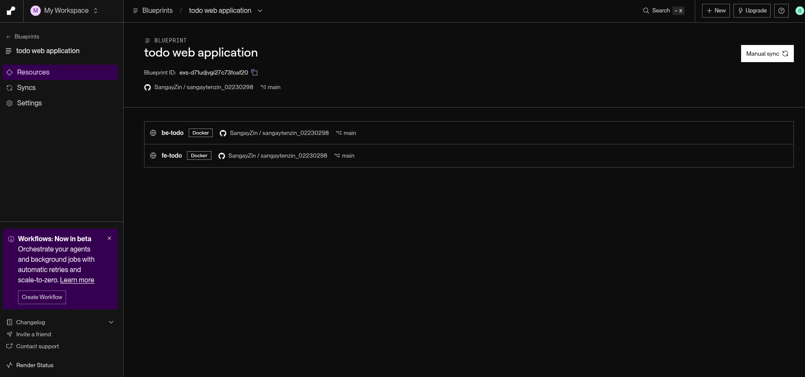
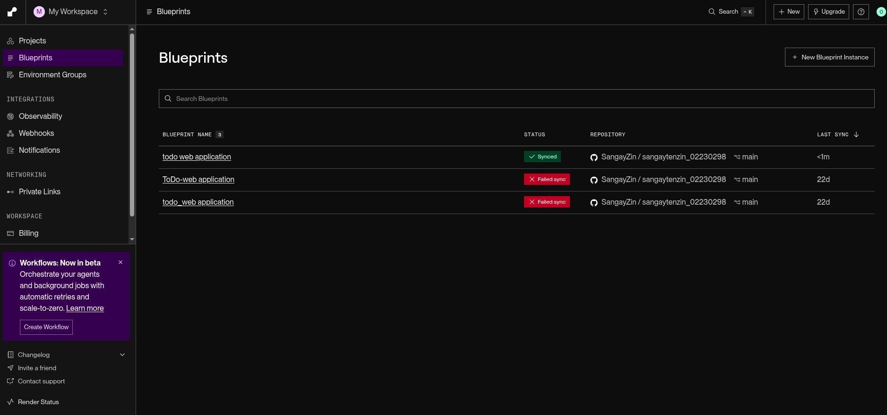

# CI/CD To-do Application Report

**Course:** DSO101 – Continuous Integration and Continuous Deployment

**Student:** Sangay Tenzin

**Student No:** 02230298

**Assignment:** Todo Application with Docker and Render Deployment

---

# 1. Introduction

This assignment focuses on building and deploying a **full-stack Todo application** using modern DevOps practices. The goal of the project is to understand how **Continuous Integration (CI)** and **Continuous Deployment (CD)** work in real software systems.

The application allows users to **add, edit, complete, and delete tasks**. The system consists of three main parts:

* **Frontend:** User interface for managing tasks
* **Backend:** API server that processes requests
* **Database:** Stores tasks permanently

The project also demonstrates how to **containerize applications using Docker** and deploy them on **Render.com** with automatic deployment from **GitHub**.

---

# 2. Technology Stack

The following technologies were used to build the application.

### Frontend

* React.js
* CSS for styling
* Environment variables for API configuration

The frontend provides a user interface where users can manage their tasks.

### Backend

* Node.js
* Express.js
* SQLite database
* dotenv for environment variables

The backend provides a **REST API** that allows the frontend to perform CRUD operations.

### DevOps Tools

* Docker (for containerization)
* GitHub (version control)
* Render.com (deployment platform)

---

# 3. Project Structure

The project follows a structured folder organization.

```
todo-app
│
├── backend
│   ├── server.js
│   ├── package.json
│   ├── Dockerfile
│
├── frontend
│   ├── src
│   ├── package.json
│   ├── Dockerfile
│
├── render.yaml
├── .gitignore
└── README.md
```

This structure separates the **frontend and backend services**, making the project easier to manage.

---

# 4. Local Development Setup

Before deployment, the application was tested locally.

### Backend Setup

First, dependencies were installed and the backend server was started.

```bash
cd backend
npm install
npm start
```

The backend server runs on:

```
http://localhost:5000
```

To confirm that the backend is running, the following command was used:

```bash
curl http://localhost:5000/api/health
```

The server returned a message confirming that it is working.

---

### Frontend Setup

The frontend application was started in another terminal.

```bash
cd frontend
npm install
npm start
```

The frontend runs on:

```
http://localhost:3000
```

Users can open the website in the browser and manage their tasks.

---

# 5. Environment Variables

Environment variables were used to store configuration settings.

This helps keep sensitive information separate from the code.

### Backend Environment Variables

```
PORT=5000
DB_TYPE=sqlite
```

### Frontend Environment Variables

```
REACT_APP_API_URL=http://localhost:5000
```

The `.env` files were added to **.gitignore** so that they are not uploaded to GitHub.

---

# 6. Application Features

The Todo application supports the following features:

### Add Task

Users can create a new task by entering a title and description.

### Edit Task

Users can update an existing task.

### Complete Task

Users can mark a task as completed.

### Delete Task

Users can remove tasks from the list.

All tasks are stored in the **SQLite database**, so they remain saved even after refreshing the page.

---

# 7. Docker Containerization (Part A)

Docker was used to package the application into containers. This ensures that the application runs the same way on any system.

### Backend Docker Image

A Docker image for the backend was built using the command:

```bash
docker build -t sangay298/be-todo:02190108 .
```


### Frontend Docker Image

Similarly, the frontend image was built using:

```bash
docker build -t sangay298/fe-todo:02190108 .
```


The student ID was used as the **Docker image tag**.

---

### Testing Docker Containers

After building the images, the containers were tested locally.

Backend container:

```bash
docker run -p 5000:5000 sangay298/be-todo:02190108
```

Frontend container:

```bash
docker run -p 3000:3000 sangay298/fe-todo:02190108
```

The application was accessed through the browser to verify that it worked correctly.

---

# 8. Pushing Images to Docker Hub

After testing, the Docker images were uploaded to **Docker Hub**.

First, login was done using:

```bash
docker login
```

Then the images were pushed:

```bash
docker push sangay298/be-todo:02190108
docker push sangay298/fe-todo:02190108
```





Images can be downloaded and deployed from Docker Hub.

---

# 9. Deployment on Render.com

The application was deployed using **Render.com**.

### Backend Deployment

A new **Web Service** was created using the backend Docker image.

Environment variable used:

```
PORT=5000
```

After deployment, Render provided a **backend URL**.




---

### Frontend Deployment

Another Web Service was created using the frontend Docker image.

Environment variable used:

```
REACT_APP_API_URL=https://be-todo-02230298-4.onrender.com
```

This connects the frontend to the deployed backend service.


---
## Docker


# 10. Automated CI/CD (Part B)

To enable Continuous Deployment, the project was connected to **GitHub**.

The project was pushed to a GitHub repository.

```bash
git init
git add .
git commit -m "Initial commit"
git push origin main
```

Render was then configured using a **render.yaml file**.
```
services:
  - type: web
    name: be-todo
    runtime: docker
    dockerfilePath: ./backend/Dockerfile
    envVars:
      - key: PORT
        value: 5000
    healthCheckPath: /api/health
    autoDeploy: true

  - type: web
    name: fe-todo
    runtime: docker
    dockerfilePath: ./frontend/Dockerfile
    envVars:
      - key: REACT_APP_API_URL
        fromService:
          name: be-todo
          property: url
    depends_on:
      - be-todo
    autoDeploy: true
```

This file automatically builds and deploys the frontend and backend services.

Whenever a new commit is pushed to GitHub:

1. Render detects the change
2. Docker images are rebuilt
3. The application is redeployed automatically

This process demonstrates **Continuous Integration and Continuous Deployment**.

---

# 11. Testing

The application was tested in several ways.

### Backend API Testing

Using curl commands:

* Fetch all tasks
* Add new tasks
* Update tasks
* Delete tasks

### Frontend Testing

The following actions were tested:

* Adding tasks
* Editing tasks
* Completing tasks
* Deleting tasks
* Refreshing the page to check persistence

All features worked correctly.

---

# 12. Conclusion

In this assignment, a full-stack Todo application was successfully developed and deployed using modern DevOps tools.

The project demonstrated important concepts such as:

* Full-stack web development
* REST API design
* Docker containerization
* Cloud deployment using Render
* Continuous Integration and Continuous Deployment

Through this project, practical experience was gained in **building, deploying, and maintaining containerized applications in a CI/CD pipeline**.

---

